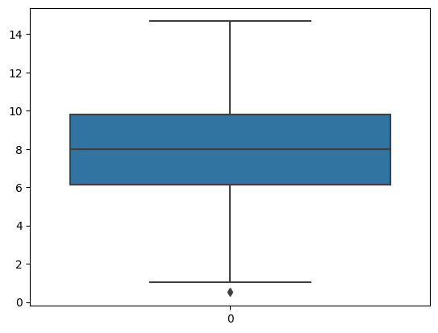
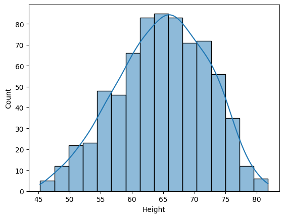
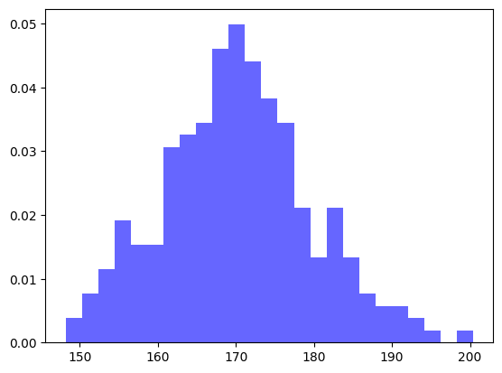
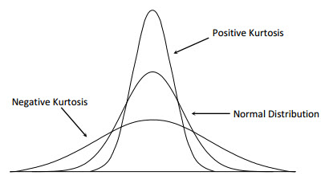
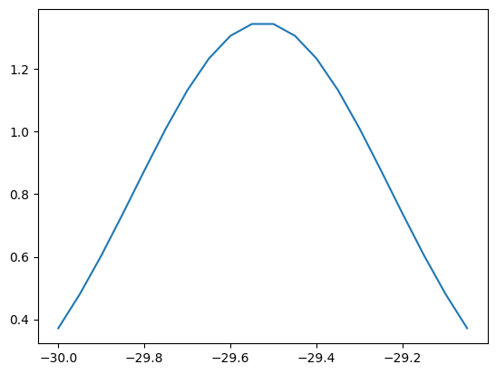
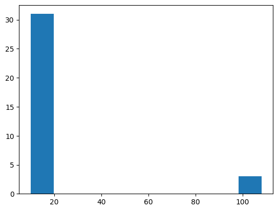
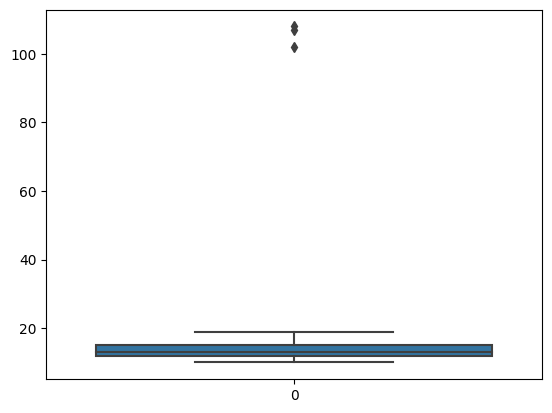

This notebook was prepared by [Shreyas Kumbhar](). Source and license info is on [GitHub](https://github.com/shreyask98/Statistics-Notes/blob/main/LICENSE.md).

# BASICS STATISTICS CONCEPT PYTHON IMPLEMENTATION

## CONTENT
### An overiew of Statistics
### 1.Types of Statistics
#### Descriptive Statistics
#### Inferential Statistics
### 2.Sampling Techniques
### 3.Variables 
### 4.Meaure of Central Tendency 
### 5.Measure of Dispersion
### 6.Percentile
### 7.Five Number Sumamry
### 8.Box Plot
### 9.Histograms

1. Statistics and its type
2. Variables
i. Quantitative variable and its type
ii. Qualitative variable and its type
3. Graph
i. Bar-graph
ii. Histogram
4. Measure of central Tendency
i. Mean
ii. Median
iii. Mode
5. Measure of Dispersion
i. Variance
ii. Standard Deviation
6. Percentiles and Quartiles 
7. 5-Number Summary
8. Boxplot
9. Normal Distribution
10. Standard Normal Distribution
11. Standardization
12. Normalization
i. Min-max scaler
13. Covariance
14. Pearson Correlation Coefficient
15. Spearman's rank correlation coefficient 
16. Poisson Distribution
17. Bernoulli Distribution
18. Binomial Distribution
19. Q-Q plot
20. Chi-square Test
21. Hypothesis Testing
22. Annova Test
23. 1-sample t-test and 2-sample t-test
24. Kernel density estimation
25. Probability density function
26. P value
27. Bell curve


## DATA
Data simply means that facts or pieces of information

Data is a collection of facts, such as numbers, words, measurements, observations or just descriptions of things.

## STATISTICS
Statistics is the science of collecting, organizing,
and analyzing data.
#### Examples:
The average height of the person in India
Predicing the election result from exit polls

## 1.TYPE OF STATISTICS
Statistics is mainly divided into
two categories:
#### 1.Descriptive Statistics
#### 2.Inferential Statistics


### DESCRIPTIVE STATISTICS
It is used to describe the data collected and
summarize the data and its properties using
the measures of central tendencies (mean,
median and mode) and the measures of
dispersion (variance and standard deviation).
#### Exmples:
Summarizing the data using
Histograms
Bar Chart
Pie Chart
and other different type of plots


### INFERENTIAL STATISTICS
It consist of collecting sample data and making a
conclusion about population data using some
experiments.
Sample (represented as small circles) is a
subset of population (represented
as rectangle)
#### Example :
Predicting the average height of students in
university(1000 students) from sample data of a
class (60 Students) using hypothesis testing etc.


## 2.SAMPLING TECHNIQUES

Let us dive into different types
of sampling techniques

#### 1.Simple Random Sampling

#### 2.Stratified Sampling

#### 3.Systematic Sampling

#### 4.Convenience Sampling


### SIMPLE RANDOM SAMPLING
In this type, every member of population
has equal chances of being selected for
sampling
#### Example:
Selecting a group ( 20 nos.) of students
from class of 100 nos.

### STRATIFIED SAMPLING
stratified sampling is selecting smaple
from population in terms of category
or group etc.
#### Example:
Selecting a group(20 boys) of students
from class of 100 nos. (boys and girls)

### SYSTEMATIC SAMPLING
Systematic sampling is sampling method
where researchers select members of
the population at a regular interval
#### Example:
Selecting every 5th person at airport to
sell a credit card.


### CONVENIENCE SAMPLING
Conevenience sampling is sampling
method where only those who are
interested in survey participates.
#### Example:
Survey Participations


## TEST YOUR KNOWLEDGE

Select the type of sampling for the
questions provided below:
#### 1.Survey regarding new technology
#### 2.Getting calls for credit cards


## 3.VARIABLES
### NUMERIC VARIABLE (Quantitative Variable)
### DISCRETE VARIABLE
A discrete variable is a variable whose value is obtained by counting. 
#### Example:
No. of bank accounts
No. of students in class
### CONTINUOUS VARIABLE
A continuous variable is a variable whose value is obtained by measuring. 
#### Example:
Area under curve
probabilty from probility density function

### CATEGORICAL VARIABLE (Qualitative Variable)
### Nominal Variable
A Nominal Variable is measurement of the data can oly be categorized.
#### Example:
Method of Travel to work for indians.
Bus,Car,Bike,Public Transport,Walked

### Ordinal Variable
A Ordinal Variable is a variable where data can be categorized and ranked.
#### Example:
Student Behaviour Ranking.
Excellent,Very Good,Good,Bad,VeryBad
 
## 4.MEASURE OF CENTRAL TENDENCY
###  Mean, Median, Mode

### MEAN
Mean is simply the avearge of the oberavtions available with us.

#### Application:
It can be used for filing up the missing values in dataset

## Data Collection.
The Dataset is collected from https://www.kaggle.com/code/kerneler/starter-lung-capacity-fc1fc5fc-3/data  
The data consists of 6 column and 725 rows.


```python
import numpy as np
import pandas as pd
import matplotlib.pyplot as plt
import seaborn as sns

import statistics

lc = pd.read_csv(r"E:\Imarticus\Datasets\LungCapData.csv") 
```


```python
lc.shape
```


    (725, 6)


```python
np.mean(lc["Height"])   ## find the mean of height
```


    64.83627586206904


### MEDIAN
First, data is arranged in ascending order and
the middle number ( in case of odd number of observations)
the average of the middle number (in case of even number of observations)

is calcuated as the median of observation

#### Application:
It can be used for detection of outliers in dataset


```python
np.median(lc["Height"])   ## find the median of height
```


    65.4


### MODE
It is calcuated as observation which is repaeated most number of times in dataset

#### Application:

It alongwth mean and median can be used for checking the skewness of dataset


```python
statistics.mode(lc["Height"])  ## find mode of height
```


    65.4


## 5.MEASURE OF DISPERSION
##### Parameters are : Variance and Standard Deviation

### STANDARD DEVIATION
It measures the dispersion of a dataset relative to its mean (population and sample) and is calculated as the square root of the variance.


```python
statistics.stdev(lc["Height"])
```


    7.2021440125030605


### VARIANCE
Variance is the expectation of the squared deviation of a random variable from its population mean or sample mean.


```python
statistics.variance(lc["Height"])
```


    51.87087837683369


## 6.PERCENTILE
A percentile is a value below which certain percentage of obervation lie.

#### Formula:
%ile =	(100 * (No. of obs. below X))/(Total no. of obs.(n))

value at %ile = (%ile * (n+1))/100


```python
# np.percentile(lc["Height"],50)
per_25 = np.percentile(lc["Height"],[25])   ## find 25 th percentile
print(per_25)

np.percentile(lc["Height"],[25,75])
```

    [59.9]
    


    array([59.9, 70.3])


## 7.FIVE NUMBER SUMMARY
Five number summary consists of following values:

### 1.	Minimum
### 2.	First Quartile( Q1 = 25th Percentile)
### 3.	Median
### 4.	Third Quartile (Q3 = 75th Percentile)
### 5.	Maximum


The numbers are really helpful to provide quicks insights about numerical data
 
BOX PLOT

The boundary of the box plot is declared by deciding the lower fence and higher fence
Lower Fence = Q1 - 1.5 (IQR = Q3-Q1)
Higher Fence = Q1 + 1.5 (IQR = Q3-Q1)

Any observation beyond boundary is considered as an outlier in dataset
 


```python
3sns.boxplot(lc["LungCap"]) ##box plot of LungCap with 1 outlier at the lower fence.
```


    <AxesSubplot: >


    

    


## Histogram
### A histogram is an approximate representation of the distribution of numerical data.


```python
sns.histplot(lc["Height"],kde = True)   ## histogram of Height
```


    <AxesSubplot: xlabel='Height', ylabel='Count'>


    

    


## QUESTIONS FOR YOU
### The dataset of ages of students in class is given below:


```python
import pandas as pd
import statistics
l1 = [ 10,14,24,26,26,16,28,20,25,38,26,23,16 ]
df = pd.DataFrame(l1, columns=['Numbers'])
print(df)
```

        Numbers
    0        10
    1        14
    2        24
    3        26
    4        26
    5        16
    6        28
    7        20
    8        25
    9        38
    10       26
    11       23
    12       16
    

### 1.	Calculate mean, median and mode of age in class


```python
mean = np.mean(df["Numbers"])
median = np.median(df["Numbers"])
mode = statistics.mode(df["Numbers"])


print("mean is:",mean)
print("median is: ",median)
print("mode is: ",median)
```

    mean is: 22.46153846153846
    median is:  24.0
    mode is:  24.0
    


### 2.	Calcualate variance and standard deviation of class.


```python
import numpy as np
# Calculating standerd deviation using std()
print(np.std(l1))
```

    6.990272192514666
    


```python
# Calculating variance using var()
print(np.var(l1))
```

    48.86390532544379
    

## Normal Distrubution (Gausian Distrubutuion)

### Properties of ND
1. Mean = Median = Mode
2. Noramal Distrubution Syemetric around the mean.
3. Bell Shape
4. Skewness is Zero (Skewness-Measure of Peakness)
    Skewness + (Right Skewness)
    Skewness - (Left Skewness)
    
https://pyshark.com/wp-content/uploads/2021/07/Kurtosis.jpg


```python
import numpy as np
import matplotlib.pyplot as plt
  
# Generating some random data
# for an example
data = np.random.normal(170, 10, 250)
  
# Plotting the histogram.
plt.hist(data, bins=25, density=True, alpha=0.6, color='b')
  
plt.show()

```


    

    


### What is kurtosis?
In statistics, kurtosis is a measure of relative peakedness of a probability distribution, or alternatively 
how heavy or how light its tails are. A value of kurtosis describes how different the tails of a given probability
distribution are from a normal distribution.

Kurtosis can take several values:            	
##### Leptokurtic-: Kurtosis >3	        
##### Platykurtic-:	 Kurtosis <3	       
##### Mesokurtic-:	 Kurtosis =3	        


```python
from IPython.display import Image
Image(filename=r"Kurtosis.jpg")
```


    

    


```python

```


```python
# pdf - probability density function
x_axis = np.arange(-30, -29, 0.05)
  
# Calculating mean and standard deviation
mean = statistics.mean(x_axis)
sd = statistics.stdev(x_axis)
  
plt.plot(x_axis, norm.pdf(x_axis, mean, sd))
plt.show()
```


    

    


## Outliers


```python

import numpy as np
import matplotlib.pyplot as plt
%matplotlib inline

## Define our dataset
dataset= [11,10,12,14,12,15,14,13,15,102,12,14,17,19,107, 10,13,12,14,12,108,12,11,14,13,15,10,15,12,10,14,13,15,10]
plt.hist(dataset)

```


    [102, 107, 108]


    

    


## Z Score


```python

outliers=[]

def detect_outliers(data):
    threshold=3 ## 3 std deviation
    mean=np.mean(data)
    std=np.std(data)

    for i in data:
        z_score=(i-mean)/std
        if np.abs(z_score)> threshold:
            outliers.append(i)

    return outliers


detect_outliers(dataset)
```


    [102, 107, 108]


### IQR
 1. Sort the data
 2. Calculate Q1 aqnd Q3
 3. IQR(Q3-Q1)
 4. Find the Lower fence(q1-1.5(iqr))
 5. Find the upper fence(q3+1.5(iqr))
 dataset=sorted(dataset)
 dataset


```python
q1,q3=np.percentile(dataset,[25,75])
print(q1,q3)
iqr=q3-q1
print(iqr)
## Find the lower fence and higher fence
lower_fence=q1-(1.5*iqr)
higher_fence=q3+(1.5* iqr)
print(lower_fence,higher_fence)
```

    12.0 15.0
    3.0
    7.5 19.5
    


```python
import seaborn as sns

sns.boxplot(dataset)
```


    <AxesSubplot: >


    

    


```python

```
